# JavaScript-100knocksV2 （随時更新）
MakeIT 研修用プログラム


## 目標
HTML、CSS、JavaScriptの基礎が理解でき、扱えること


一例としての回答を[answer](./answer/example)に設置します。自分と相談してから確認して下さい。


[※回答方法は解答手順](./answer/example/回答手順.md)  


---


# HTML
1. ## helloTable 
    3x3の表を画面に表示して下さい。コンテンツはすべて「こんにちは」。一番左の列は縦に３つ結合してください。
    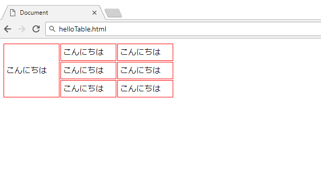


2. ## anchor
    [Make ITホームページ](https://isc-makeit.github.io/Make-IT-homepage/)に遷移するリンクを3つ表示してください。  
    1つは同一のタブ上で開くように  
    1つは新しいタブで開くように  
    1つはjavascriptのwindow.open()を使用して開くように


3. ## form
    formタグを使って個人情報送信フォームを作ってください。完成後submitボタンを押して、URLを確認して下さい。入力された情報がURLに正しく追記されているか確認して下さい。  
    フォームの仕様
    ```
    名前: (type="text") 必須項目にすること
    Eメール: (type="email") 
    パスワード: (type="password")
    年齢: (selectタグとoptionタグ) 0~200歳まで選べること
    性別: (type="radio") labelタグも使用すること
    送信ボタン(type="submit")
    formタグの属性にmethod="get"を追加すること
    必須項目が入力されていない場合、入力を促すような仕組みにすること
    ```    
    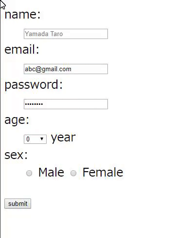


---


# CSS
1. ## centerDiv
    300px四方のdivを画面の上部中央に表示してください。色は赤、画面幅が変わっても中心に移動するようにして下さい。
    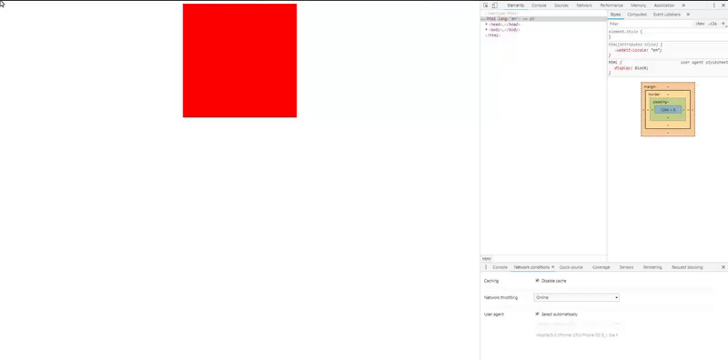


1. ## shadow
    hover時box-shadowでハイライトするようにして下さい。

    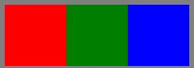


1. ## nav
    横並びのナビゲーションバーを実装してください。    
    仕様
    ```
    コンテンツはの6つ
    マスオーバーした際に色が変わること
    ```
    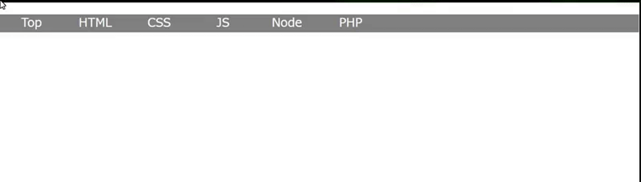


1. ## onImage
    画面に画像を表示し、その画像の上に一回り縮小させた同じ画像を重ねて表示、その縮小画像の上に「AAAA」と表示してください。一番大きな画像の外下側中央に画像のタイトルを設置してください。画像のタイトルだけかっこいいフォントを使ってください。
    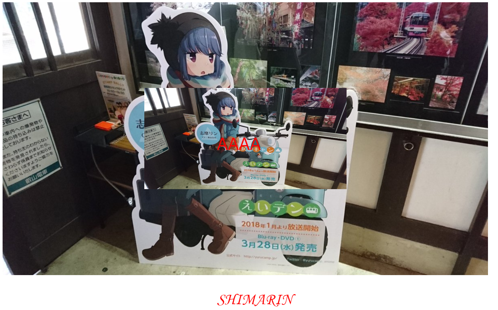


1. ## new
    以下のhtmlでnewクラスがついているものだけコンテンツの末尾にnewがつくようにしてください。  
    ```html
      <ul>
        <li>ポッポ</li>
        <li>カイオーガ</li>
        <li class="new">ゼラオラ</li>
        <li>ガオガエン</li>
      </ul>
    ```
    出力例  
    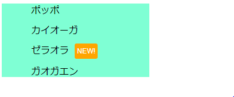

1. ## float
    floatを使い、100px四方のdiv群を以下のように並べてください。  
    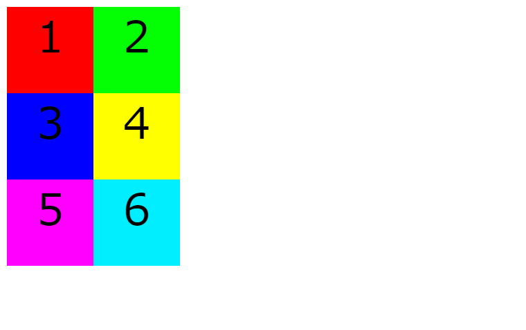

1. ## flexbox
    flexboxを使い、100px四方のdiv群を以下のように並べてください。  
    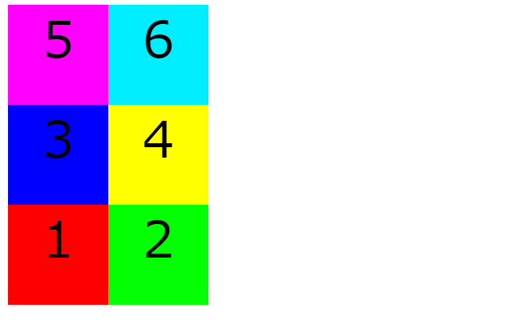

1. ## CSS Grid
    CSS Gridを使い、以下のようなレイアウトを作りなさい。文字・画像は任意で。
    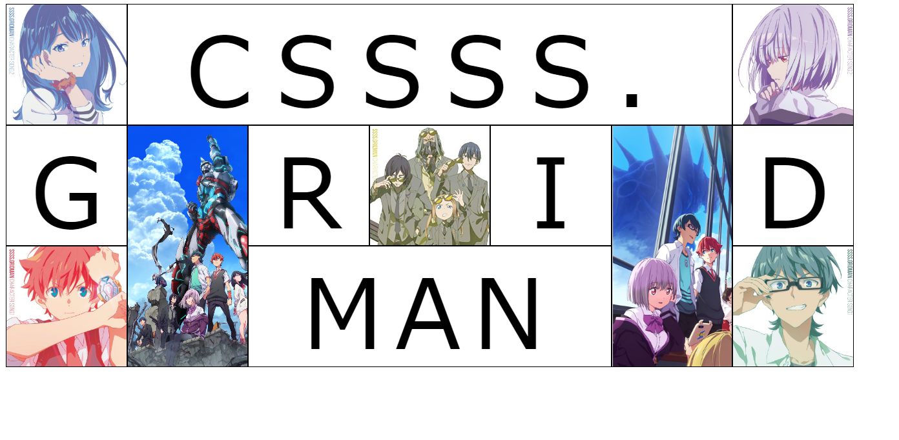

1. ## position
    スクロールしても動かないdivと、途中から途中まで固定されるdivを作ってください。
    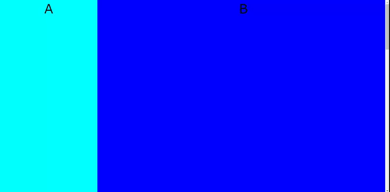

1. ## drawing
    CSSを使ってキャラクターを1人描いてください。皆さんの力作をお待ちしております。ドット絵は無しでお願いします。  
    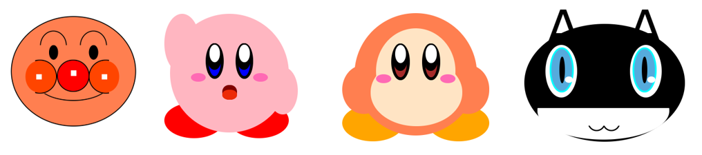

---


# JS
1. ## wTime
    現在の時刻を取得して出力してください。画面は自動で更新するように。  
    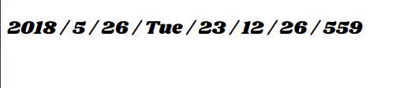


1. ## add
    自身が呼び出された数を出力する関数addを作成してください。
    e.g.
    ```js
    add();
    add();
    add();
    ```
    出力
    ```
    1
    2
    3
    ```


1. ## toBin
    テキストフォームから入力された10進数を2進数にして出力してください。


1. ## toHex
    テキストフォームから入力された10進数を16進数にして出力してください。


1. ## randomBgColor
    ボタンを押すと背景色がランダムに変わるwebページを作成してください。


1. ## bored
    画面中央に表示された「I'm so bored」の文字をクリックすると「AWESOME!」に書き換わるプログラムを作成してください。「AWESOME」は大きさ128px、色黒以外。

    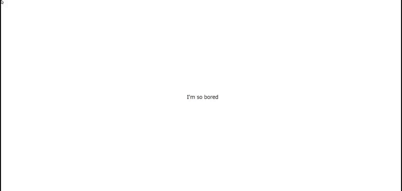


2. ## addImage
    ボタンを押す事に画像が追加されるようにしてください。
    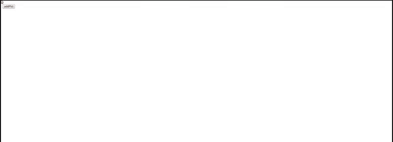


1. ## createDiv
    100px四方のdivを生成するボタンを作ってください。  
    仕様
    ```
    色は緑
    自動に画面端で折り返すようにする
    ```

1. ## switch
    switch caseを使い、ランダムに数種類の画像が現れるボタンを作ってください。
    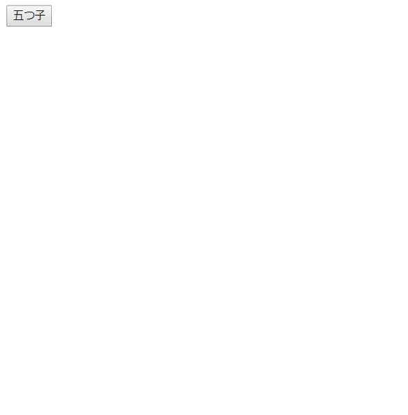

1. ## 3sec
    3秒後にalert()を実行するボタンを作ってください。

    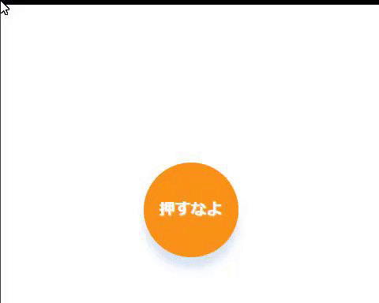


1. ## isSame
    ボタンを押すと2つのテキストフォームに入力された文字列を比較し、同一文字列であれば「True」、それ以外であれば「False」とアラート出力するプログラムを作成してください。


1. ## sumSequence
    1からnまでの和をコンソール出力するプログラムを作成してください。nはフォームに入力された値である。for文を使用すること。
    

1. ## pulldown
    0から200まで選択できるプルダウンメニューを作ってください。javascript:document.createElement()を使うこと

1. ## storage
    互いに遷移しても、選択しているプルダウンが残るHTMLファイルを2作りなさい。
    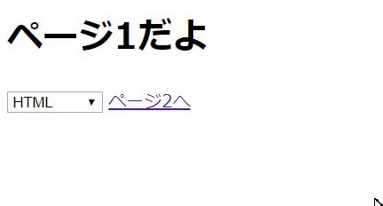


1. ## fizzbuzz
    1 ~ 100の数値を順番に列挙し、列挙している数値が３で割り切れる場合は'fizz'を5で割り切れる場合は'buzz'を、15の倍数になるものは'fizzbuzz'をconsoleに表示して下さい。  

    ```
    1  
    2  
    fizz  
    4  
    buzz  
    fizz  
    7  
    8  
    fizz  
    buzz  
    11  
    fizz  
    13  
    14  
    fizzbuzz
    ```


1. ## array1
    配列内を順にコンソール出力してください。  
    入力:  `const ary = ['a','b','c','d','e','f','g'];`  
    出力: 
    ```js
    a
    b
    c
    d
    e
    f
    g
    ```


1. ## array2
    配列内を順にコンソール出力してください。出力の際に各要素のindex値を足して下さい。  
    入力:  `const ary = ['a','b','c','d','e','f','g'];`  
    出力: 
    ```
    a0
    b1
    c2
    d3
    e4
    f5
    g6
    ```


1. ## array3
    宣言された変数が配列かどうか評価してください。
    入力
    ```js
    var ary=[]
    var num=1
    var obj={}
    ```
    出力
    ```js
    true
    false
    false
    ```


1. ## typeof
    以下の様に宣言された変数の型を評価して出力してください。  
    入力: 
    ```js
    var num=1; 
    var zero=0;
    var str='1';
    var zs='0';
    ```
    出力
    ```js
    number
    number
    string
    string
    ```


1. ## concat
    2つの配列を結合して出力してください。  
    配列1 `ary1=['a','b']`  
    配列2 `ary2=['c','d']`  
    出力
    ```js
    ['a','b','c','d']
    ```


1. ## join
    15 concat で作った配列を出力してください。出力する際、配列内の要素を結合して出力してください。  
    配列 `ary=['a','b','c','d']`  
    出力  
    ```js
    abcd
    ```


1. ## rensouhairetu
    連想配列に値を1つ追加し、配列内のすべてのkeyとvalueを出力してください。
    連想配列: `ary={'color':'red','size':'100'}`
    追加する要素: `{'count':'5'}`
    ```
    keyは: color valueは: red
    keyは: size valueは: 100
    keyは: count valueは: 5
    ```


1. ## wather
    配列aryの内容をランダムに出力するプログラムを作成してください。  
    配列ary `ary=['晴れ','雨','曇り','槍']`  
    e.g.出力
    ```
    今日の天気は 槍 です
    今日の天気は 晴れ です
    今日の天気は 晴れ です
    今日の天気は 曇り です
    今日の天気は 雨 です
    ```


1. ## encrypto
    以下の文字数列`word`を暗号化して出力するプログラムを作成してください。  
    暗号のルール: 各数字の後ろに2つ余計な数字を追加する。  
    例
    ```js
    var raw='123';
    ～処理～
    console.log(raw); //=>198276354
    ```
    平文はなんでもいいですが例として
    ```js
    114514
    ``` 


1. ## decrypto
    暗号化した変数`crypto`から不要な文字を削除して出力するプログラムを作成してください。  
    hint: 暗号のルールは３文字おき
    ```
    const crypto='やくこみがんきいばていんるよは'
    ```


1. ## tanuki
    入力された文字列に含まれる「た」が連続した場合一文字に置換して、一つ以上の「ふ」が含まれた場合は「ふ」をすべて削除して出力するプログラムを作成してください。  
    入力値
    ```text
    ふわたたしが両手をひろげても、お空はちっとも飛べないが、飛べる小鳥はわたしのように、地面をはやくは走れない。

    わたたしがからだをゆすっても、ふきれいな音は出ないけど、あの鳴る鈴はわたたしのように、たたくさんなうたたは知らないよ。

    鈴と、小鳥と、それからわたたし、みんなふちがって、みんないい。
    ```


1. ## duplicate
    1～75までのランダムな整数を重複なく25個格納した配列を出力するプログラムを作成して下さい。
    数字が重複しないよう気をつけて下さい。


1. ## dupSort
    36.duplicate で作成した配列内を昇順でソートして下さい。  
    e.g. 入力  
    `ary=['10','3','25','6','5']`  
    出力  
    `ary=['3','5','6','10','25']`


1. ## dupDel
    テキストフォームから指定された数値が、37.dupSort で作成した配列内にある場合削除し、削除後配列の大きさを削除した分だけ縮小した配列を返すプログラムを作成して下さい。指定された数が見つからなかった場合は「error: Can't deleted」と出力して下さい。


1. ## partOfTable
    25マスのテーブルを用意し、それぞれのマス目に1～75の数字を割り当ててください。数字は昇順で重複がないようにしてください。
    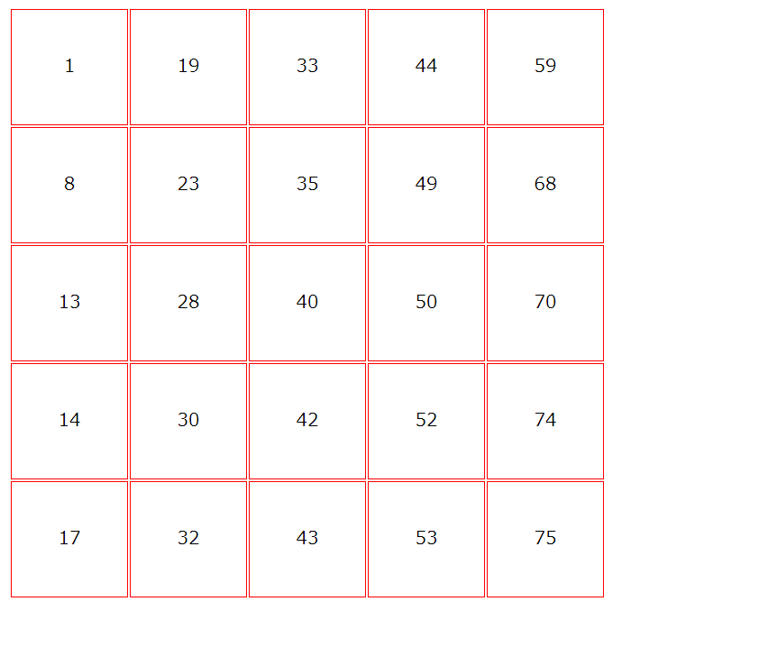


1. ## whichPlace
    partOfTableで作ったマスをクリックした際にその場所に割り当てられた数をalertするようにしてください。


---


# JQuery
1. ## jquery
    ボタンを押すと「Cosmos」が「Chaos」に書き換わるようにしてください。  
    jqueryのCDNを読み込んでjqueryを使って実装してください。
    
    [ノンプログラマーのためのjQuery入門](https://www.slideshare.net/hayatomizuno/jquery-7665168?ref=http://weboook.blog22.fc2.com/blog-entry-349.html)


1. ## incrementHello
    ボタンを押すとボタンの下に 「Hello」 + 押した回数が追加されるプログラムを作成してください。  
    jqueryを使って実装してください。


1. ## chageColor
    画面に要素を3つ配置しクリックすると背景色が変わるようにしてください。  
    それぞれjqueryを使って実装してください。  
    やり方は一つとは限りません。それぞれ別の実装方法で実現してみて下さい。
    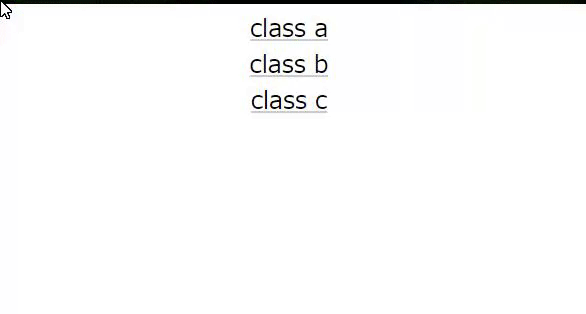


1. ## addImageJq
    ボタンを押す事に画像が追加されるようにしてください。jQueryを使って実装してください。


1. ## hasImage
    4.addImageJqを改造して、ボタンクリックした時画像がすでにある場合は追加しないようにしてください。jQueryを使って実装してください。


1. ## selectImage
    5.hasImageを改造して、画像の追加上限を3枚にして下さい。jQueryを使って実装してください。


1. ## removeImage
    6.selectImageを改造して、クリックした時クリックされた画像が消去されるようにしてください。jQueryを使って実装してください。

